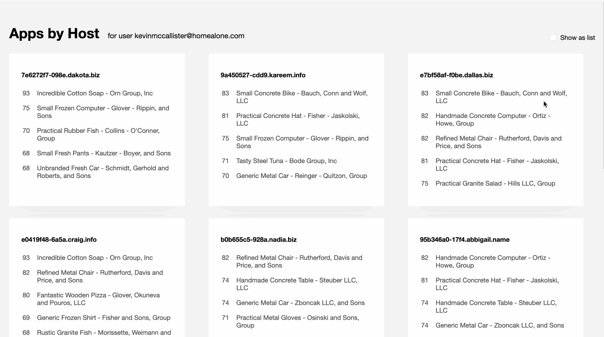
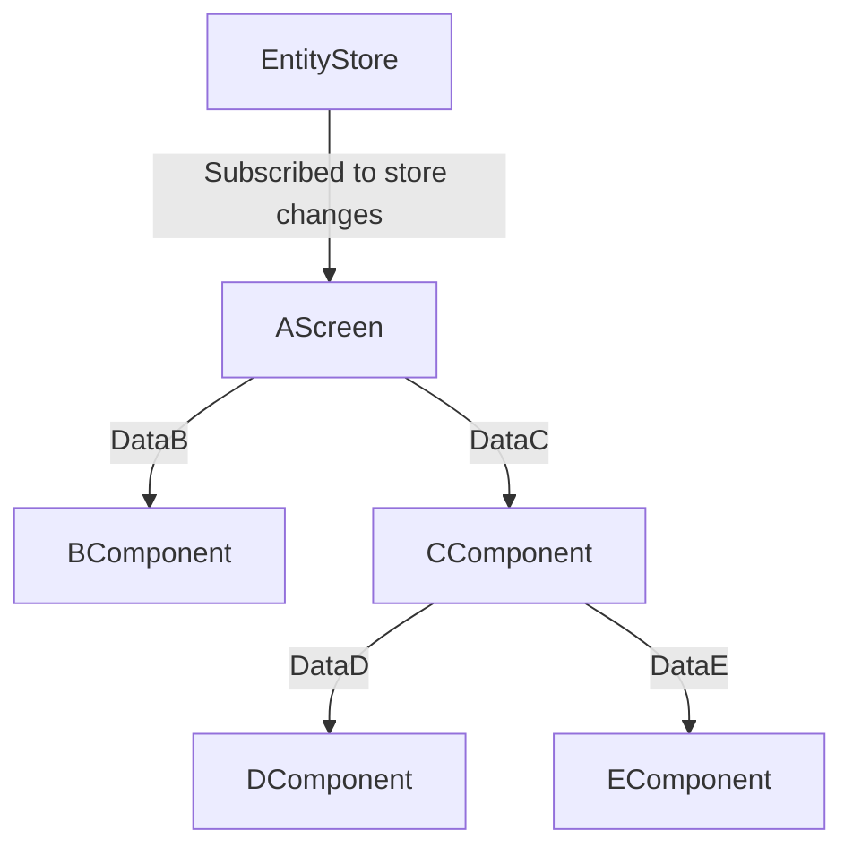
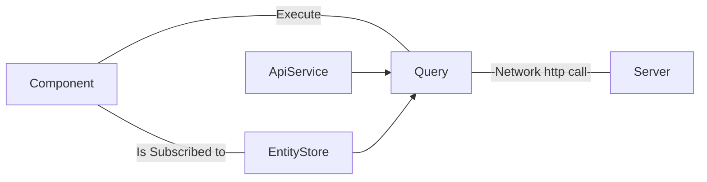
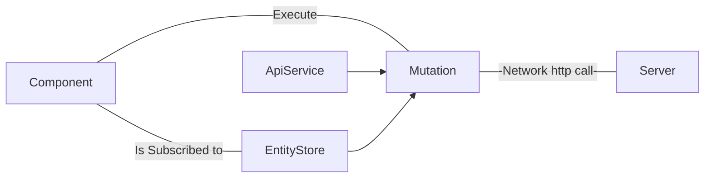

# Apps by Host

## Description

We want to build a new page view that shows the list of applications running on every host.

* An application has a name, a list of contributors, a release version number, and a list of hosts that the app has been deployed at.

* Each application has an Apdex metric assigned. The Apdex score is a positive integer between 0 (Frustrated) and 100 (Satisfied). Apdex is an industry-standard to measure users' satisfaction based on the response time of web applications and services.


## File Naming

The project always follows the `camelcase` name nomenclature, classes start in capital letter, trying as much as possible to add as a suffix the type of file that we are naming.

As far as possible, follow the simple rule of being descriptive, explaining with a concise name what the content of the file is dedicated to.

## Folder Structure

```
apdex-board/
    ├─data/
    │  ├─ host-app-data.json
    │  ├─ users-data.json
    |
    ├─src/
    │  ├─ application/
    |  ├─ domain/
    |  ├─ infrastructure/
    |  |
    │  ├─ index.css
    │  ├─ index.ts
    │  ├─ index.html
    |
    ├─ README.md
```

### Data

Mocked data in json format from some domain entities.

### Src

Application source code with four distinct layers:

1. Domain
2. Application
3. Infrastructure

#### Domain

Everything related to the domain entities of our business.

#### Application

Domain Use Cases.

#### Infrastructure

Layer dedicated to the implementation details of the previous layers.

```
infrastructure/
    ├─bus/
    ├─http/
    ├─logger/
    ├─mutation/
    ├─query/
    ├─store/
    ├─ui/
    ├─theme/
```

##### Http

ayer dedicated to all the implementation details regarding the calls to the http server.

In our case, since we don't have a server, many of these calls return mocked or imported data from the json that we have placed in the `data` folder.

#### Logger

Implementation to launch traces in logs.

#### UI

Implementation relative to the user interface, such as when rendering components to the screen.

##### Theme

Implementation related to the style that we can apply in our user interface components.

In our implementation, simple vanilla css custom properties, we can set multiple themes here as new variables in a new `vars.css` file that will define a custom style for the application.

## Architecture

### Decisions

#### Styling

I have decided to simply use the standard to apply and architecture the styles of the application.

This would just be using css, perhaps with some help from postcss that would let me use the [nesting draft proposal](https://www.w3.org/TR/css-nesting-1/) to make the code much more readable and maintainable.

I have tried to achieve these six targets:

* The most standard way possible, use the web.
* Avoid style collisions (simple class naming convention).
* Minimum coupling between internal parts.
* Fully customizable injectable themes.
* Fast propagation of changes.
* Easily plug into a design system.
* Independent but easily implementable in any library or front end framework.

#### Theming

Take into account that the application is customizable by a theme.

It is because in the component properties we are setting custom variables that can be set easley from a simple `vars.css` file.

For example:

```css
color: var(--abh-app-color, var(--abh-color-text-default));
```

`--abh-app-color`: global text color.

`--abh-color-text-default`: global default text color fallback that will be applied if there are not `--abh-app-color`.

Pay special attention that the names of the variables, the theme, and the default theme have a naming convention that allows you to know what the variable's application scope is and avoids collisions.

Depending on our global operating system settings, the application will be configure to apply the default light or dark theme.

**Default Light Theme**



**Default Dark Theme**


#### Components

After a day working on the application I understood that a piece would be interesting, I have called it `Component` that could save me a lot of boilerplate, give consistency and manage the life cycle of each component.

Each component hooks to another component already arranged in the DOM that we find through its id.

This diagram shows what the life cycle would look like in the render method of a component:


Note that, in each render of the component, the first thing we do is empty the node if it exists in the dom to be able to render the template again with its updated data if any.

See that, in this diagram several methods that belong to the life cycle of the component to which we can hook ourselves are described.

* **onComponentWillUnMount**. Indicates the point at which we know the component will be unmount.
* **onComponentDidUnMount**. Indicates the point at which we know the component was unmount.
* **onComponentWillMount**. Indicates the point at which we know the component will be mount.
* **onComponentDidMount**. Indicates the point at which we know the component was mount.

Looking at a practical example we could create the following `FooCompoent` component that extends our `Component` class as follows.

First off all take into account the interface to `ComponentConfigInterface`

```typescript
export interface ComponentConfigInterface {
  children?: Component[];
  data?: any;
  logger: LoggerInterface;
  name: string;
  prefix?: string;
  rootId: string;
  suffix?: string;
  template?: string;
}
```

We use that interface to pass an object typed structure into our component constructor.

Then we can start to write our component class `FooComponent`:

```typescript
export class FooComponent extends Component {
  constructor(componentConfig: ComponentConfigInterface) {
    super({
      rootId: componentConfig.rootId,
      name: componentConfig.name,
      template: componentConfig?.template,
      logger: componentConfig.logger,      // our send logs implementation
    });

    const inputClasses = this.getInputClasses();

    this.template = `
      <div id="${this.prefix}-${this.name}" class="${this.prefix}-${this.name}">
        Hello world!
      </div>`;
  }

  onComponentWillMount(): void {
    // Note that we are hook and overwriting the onComponentWillMount
    // `Component` by our specific method.

    this.logger.info(`${this.prefix}-${this.name} component will mount`);
  }

  onComponentDidMount(): void {
    // Note that we are hook and overwriting the onComponentDidMount
    // `Component` by our specific method.

    this.logger.info(`${this.prefix}-${this.name} component did mount`);
  }

  onComponentWillUnMount(): void {
    // Note that we are hook and overwriting the onComponentWillUnMount
    // `Component` by our specific method.

    this.logger.info(`${this.prefix}-${this.name} component will unmount`);
  }

  onComponentDidUnMount(): void {
    // Note that we are hook and overwriting the onComponentDidUnMount
    // `Component` by our specific method.

    this.logger.info(`${this.prefix}-${this.name} component did unmount`);
  }
}
```

Then let's instantiate our `FooComponent` component class to get our own

```typescript
const fooComponent = new FooComponent({
  rootId: `app`,
  name: 'foo',
  logger: this.logger,
});
```

This component could already render to a dom that had the following node with id `app`.


```html
<div id="app">
  <!-- Our `fooComponent` will be render here when fooComponent.render() will be invoke -->
</div>
```

Okay, I know that this class is nothing special, it does not pretend to be, nor to reinvent the wheel, it has simply helped me make the relationship of the components with each other more efficient, define their hierarchy, manage their life cycle and update them with new data in the dom without having to repeat the same code over and over again.

I know that this class is not a magical solution and that there would be many points to discuss, how the components communicate, how can I add event listeners, how can I improve the render performance, etc.

But in a certain way, to finish this application has allowed me to structure my components in a very comfortable way, being able to apply granularity in their scope without any other pretension.

This allow to me avoid a lot of repeat code

Creating elements

```js
 const createEl = document.createElement('div')
```

Append elements

```js
parentEl.appendChild(createEl)
```

Insert Element Before Another

```js
parentEl.insertBefore(createEl, firstchildEl)
```

Replace a Child Element

```js
parentEl.replaceChild(createEl, firstchildEl)
```

Remove a Child Element

```js
parentEl.removeChild(firstchildEl)
```

**Render Children Components**

Something interesting about this class is that it allows us to indicate the child components of our components which will be rendered within the life cycle of our parent component.

These child components could in turn have more child components that would follow the same render flow until ending up in a component without descendants.

Let's see where we are doing this recursive rendering of components and their descendants:

```typescript
mountComponent(template?: string): void {
  if (template) {
    this.node.innerHTML = this.node.innerHTML + template;
  }

  if (!template && this.template) {
    this.node.innerHTML = this.node.innerHTML + this.template;
  }

  // Rendering children components that our parent component has
  if (this.children && Array.isArray(this.children)) {
    for (const child of this.children) {
      try {
        child.render();
      } catch (error) {
        this.logger.error(`Error mounting ${child.name} component: ${this.errors.NODE_IS_NOT_FOUND}`);
        throw Error(error);
      }
    }
  }
}
```

#### Stores

We can create as many Stores in infrastructure layer as we need from the interface of the store domain entity `StoreInterface`.

```ts
export interface StoreInterface {
  items: any[];
  bus: BusInterface;
  isInclude(itemId: string): boolean;
  setItems(items: any[]): void;
  get(itemId: string): any;
  add(item: any): void;
  remove(itemId: string): void;
  update(items: any[]): void;
  clear(): void;
  subscribe(message: string, eventHandler: EventHandlerType): void;
}
```

In the implementation of these Stores we must publish an event every time we produce changes so that, through the subscribe method, any component can listen to these changes and decide what to do when they happen.

To publish and subscribe to these events I have written a simple Event Bus, nothing fancy but it does the job.

I know **a better way would have been to be able to extend a base `Store` class** that already contains all of this functionality of subscribing and publishing events when changes happen to the store, but I have not had more time to refine those details.

The really interesting thing would have been to leave only the possibility of being able to subscribe to an entity store from a `Screen` type component.

Probably it would have been a good idea to extend the `Component` class in a new class called `Screen` that contains these functionalities, in this way we could only use the entities store features in the top level of the components, that is, in the screens.



#### Queries and mutations

Each query or mutation works in the same way. When a component executes a query or a mutation, it looks to see if the data we want is fresh in the cache/store or stale. If they are fresh we will directly return the content of the cache in the store, if they are stale we will call the server with a specific apiService to refresh this data from the server to our cache.

**Queries**



**Mutations**



## Testing

I have tested some parts of the code. Generally related to the application layer and its use cases.

For this I have used [Jest](https://jestjs.io/), which is easier to configure, although perhaps if I only needed to test pure functions in unit tests I would try to configure [Mocha](https://mochajs.org/) [Chai](https://www.chaijs.com/) and [Sinon](https://sinonjs.org/) with more time because this environment seems much more reliable and standard to me

I probably should have decoupled some unit tests by mocking some parts since right now, they are coupled and the tests have some integration part and are not 100% unit.

I was working creating those mocks but I ran out of time although at least I left enough evidence of how I would do these tests and I think it is something to add to the evaluation

## Please attention

Please, regarding this section of the requirements:

> Implements the “addAppToHosts” and “removeAppFromHosts” methods, which update the list of applications with higher Apdex whenever any of these methods is called. (Hint: Be warned that when an app gets removed, “getTopAppsByHost” still has to return 25 items). These two methods are not triggered from anywhere in the design: that’s ok, in this case we care about the logic and not about the UI layer.

Since our apps entity store has events to subscribe to from the home screen, we can run a new render whenever we have new data.

This means that, if we execute the `getHostnamesTopAppsQuery` once the subscribers have been notified of these changes, it will return the list of hostnames top apps correctly updated with the new apps ordered by apdex.

Therefore, by design of the pattern, we will always have our dashboard view updated when adding an app or removing it from certain hostnames using the mutations `addAppToHostnamesMutation` and `removeAppFromHostnamesMutation`.

We have in the application layer the pure functions `addAppToHostnames` and `removeAppFromHostnames` use cases that are doing all the insertion/extraction hard work behind the scenes.

## Commands

### Install dependencies
Execute the command `npm i` to install all dependencies that project requires.

### Run
Execute `npm start` to run the project in a local server

### Build

### Test
`npm run test`

#### Watch
`npm run test:watch`

#### Coverage
`npm run test:coverage`

## Format code

We are using [prettier](https://prettier.io/) to format the code base.

Execute `npm run format` to format and fix the code.

### Check

If you are only are interested in check what format issues have your code, execute `npm run format:check`.
